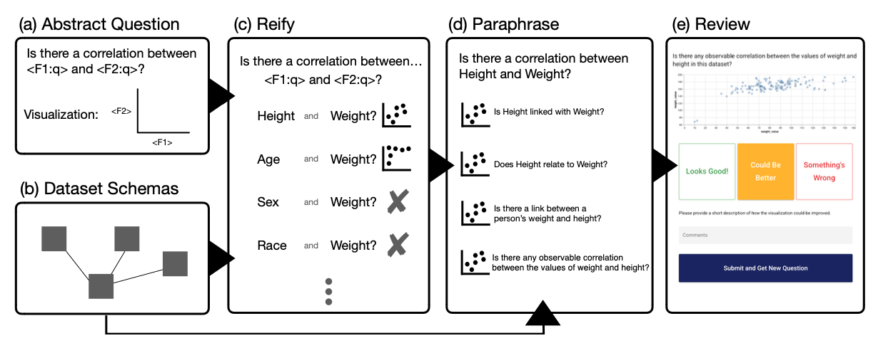

# DQVis Dataset: Natural Language to Biomedical Visualization

This repository contains the code for generating the **DQVis** dataset available on [Hugging Face](https://huggingface.co/datasets/HIDIVE/DQVis).

The code generates a collection of natural language **Q**ueries on biomedical research **D**ata and responds with a visualization specification in the form of the [Universal Discovery Interface](https://github.com/hms-dbmi/udi-grammar) grammar.

📂 **Dataset on Hugging Face**: [HIDIVE/DQVis](https://huggingface.co/datasets/HIDIVE/DQVis)  
🔍 **Dataset Review Software**: [hms-dbmi/DQVis-review](https://github.com/hms-dbmi/DQVis-review)

---

## 🚀 Overview



The overall pipeline can be run from `main.py` and consists of a few high-level steps.

1. **Template Generation** will create abstract questions and specifications with placeholders for entities and fields as well as constraints for those entities/fields.
2. **Schema Generation** will create dataset schemas based on provided datasets.
3. **Template Expansion** will reify the template questions/specifications given the provided schemas for all possibilities that satify the constraints.
4. **Paraphraser** will use an LLM framework to paraphrase input questions to cover different styles of expertise and formality in the input.
5. **Export / Upload** The will be exported in various figures and uploaded to Hugging Face.

---

## 🛠️ Usage

To generate data, run `main.py` with the appropriate flags:

```bash
python main.py [options]
```

### Available Options

| Flag            | Description                                                                  |
| --------------- | ---------------------------------------------------------------------------- |
| `--schema`      | Update the data package schema based on files in the `./datasets` folder     |
| `--upload`      | Upload the generated training data to Hugging Face                           |
| `--hf_local`    | Save training data locally in Hugging Face-compatible format                 |
| `--paraphrase`  | Perform paraphrasing of training data                                        |
| `--only_cached` | Use only locally cached data for paraphrasing (no new paraphrase generation) |
| `--sqlite`      | Export the generated data to an SQLite database                              |
| `--sample`      | Export a sampled subset of the data to SQLite                                |
| `--json`        | Export the data to JSON format                                               |
| `--parquet`     | Export the data to Parquet format                                            |

You can combine multiple flags. For example, to paraphrase and export to SQLite:

```bash
python main.py --paraphrase --sqlite
```

To also upload the full dataset after generation:

```bash
python main.py --paraphrase --sqlite --upload
```

---

## 🗂️ Folder Structure

```
.
├── datasets/        # Source structured data files
├── main.py          # Entry point for dataset generation
├── out/             # Generated datasets (optional exports)
└── README.md        # This file
```

---
